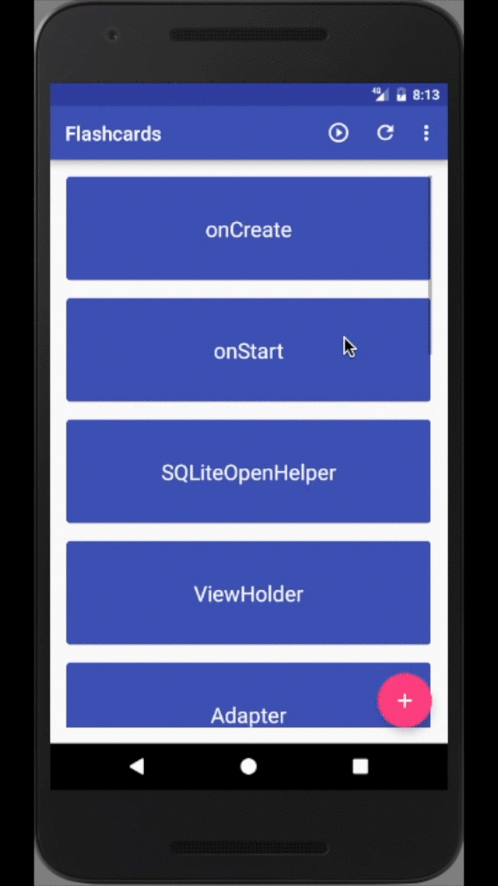

# Flashcards
`Flashcards` an Android app to help users bear vocabulary, historical date or any subject matter that can be learned via a question-and-answer format.

Flashcards are locally stored in the SQLite database on the device, and populated using content provider and recycler view. The use of services allows users to schedule daily reminder notification and add a widget to home screen. Flash mode helps user review cards in a flash. FAB and swipe gestures enrich user experiences. 

## Launch the app

## Add a new card

## Swipe to delete

## Shuffle cards

## Flash mode

## Set reminder

## Add widget

